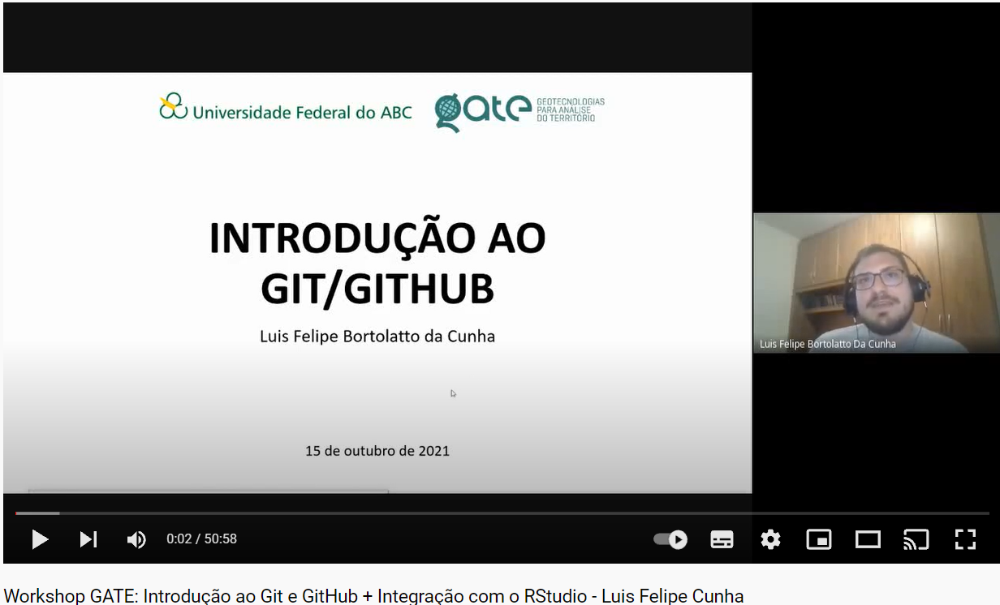
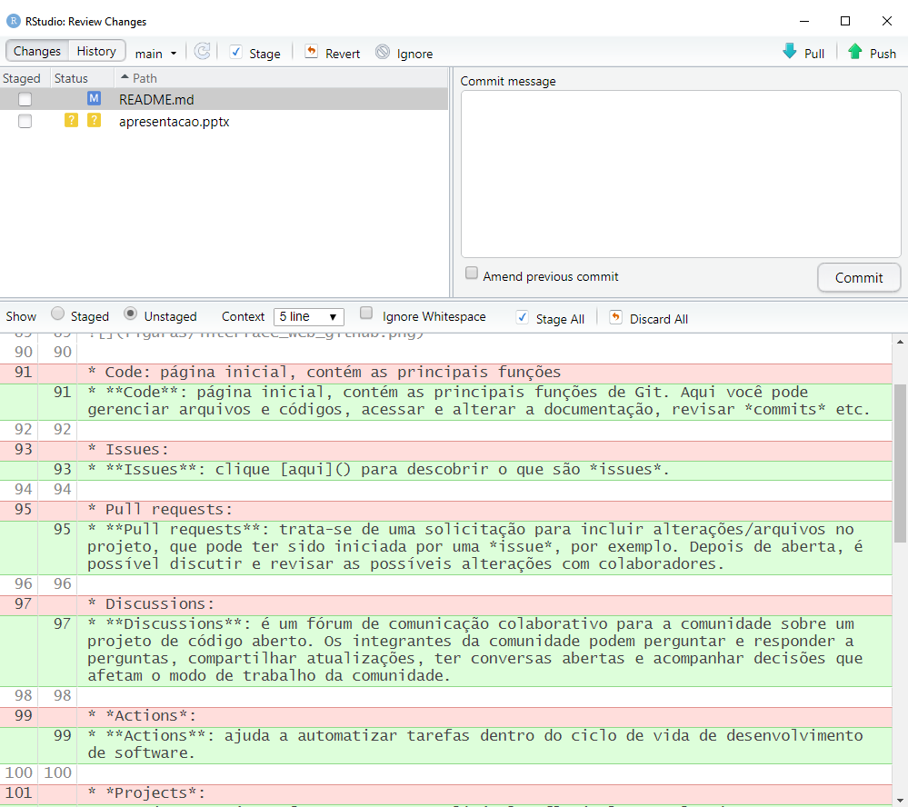

# INTRODUÇÃO AO GIT/GITHUB

Esse workshop foi apresentado no grupo de pesquisa [GATE](https://gateufabc.wixsite.com/gate) em 15 de outubro de 2021. Ele aborda uma introdução ao Git e GitHub, sua integração com o RStudio e uma atividade prática introdutória. A gravação está disponível no [YouTube](https://www.youtube.com/watch?v=9z8jKm4VUnk).

**SUMÁRIO**

* [INTRODUÇÃO AO GIT E GITHUB](#introdu%C3%A7%C3%A3o-ao-git-e-github)

    * [Introdução ao Git](#introdu%C3%A7%C3%A3o-ao-git)
    
    * [Workflow (Git)](#workflow-git)
    
    * [Introdução ao GitHub](#introdu%C3%A7%C3%A3o-ao-github)
    
    * [Interface web (GitHub)](#interface-web-github)

    * [Download e configuração](#download-e-configura%C3%A7%C3%A3o)

* [INTEGRAÇÃO COM O RSTUDIO](#integra%C3%A7%C3%A3o-com-o-rstudio)

* [ATIVIDADE – Download de dados geoespaciais oficiais do Brasil no R com o pacote *geobr*](https://github.com/luisfelipebr/git2021/tree/main/atividade#atividade--download-de-dados-geoespaciais-oficiais-do-brasil-no-r-com-o-pacote-geobr)

## INTRODUÇÃO AO GIT E GITHUB

### Introdução ao Git

O [Git](https://pt.wikipedia.org/wiki/Git) é um **sistema de controle de versão distribuída** de código aberto, muito utilizado no desenvolvimento de software, mas também adotado em outros campos, principalmente por *facilitar a reprodutibilidade científica*.

[Em partes:](https://www.freecodecamp.org/news/what-is-git-and-how-to-use-it-c341b049ae61/)

* **Sistema de controle**: o Git pode ser utilizado para armazenar conteúdo - principalmente códigos devido aos outros recursos que oferece.

* **Sistema de controle de versão**: o código armazenado no Git muda continuamente à medida que mais código é adicionado. Além disso, várias pessoas diferentes podem adicionar códigos em paralelo. Um sistema de controle de versão mantém um histórico das mudanças, permitindo consultar ou retornar à uma versão anterior do código.

* **Sistema de controle de versão distribuída**: o Git possui um repositório remoto, que fica armazenado em um servidor, e um repositório local, no computador de cada pessoa envolvida (analista, desenvolvedor, gestor). Ou seja, o código não fica centralizado apenas em um servidor central, qualquer pessoa autorizada pode ter acesso a uma cópia completa do código, modificá-la e propor alterações no repositório remoto.

Portanto, o Git permite: armazenar códigos; que várias pessoas trabalhem em um projeto ao mesmo tempo; voltar à uma versão antiga dos códigos caso o projeto mude ou um erro seja introduzido; que várias versões do projeto corram em paralelo; e que diferentes pessoas tenham acesso a uma cópia do repositório remoto.

### Workflow (Git)

O Git possui diversos comandos que apoiam a manipulação dos repositórios e arquivos ali guardados. A figura acima apresenta um workflow básico, com alguns comandos essenciais:

* git *clone*: copia um repositório remoto (armazenado em um servidor) para o seu computador.

* git *add*: adiciona um conjunto de arquivos/alterações da "área de trabalho" para o índice (*index/staging area*).

* git *commit*: confirma os arquivos/alterações no repositório local.

* git *push*: atualiza o repositório remoto com base nas alterações realizadas no repositório local.

* git *pull*: atualiza o repositório local com base na última versão do repositório remoto.

### Introdução ao GitHub

O [GitHub](https://en.wikipedia.org/wiki/GitHub) é um **provedor de hospedagem na internet** para arquivos e códigos (repositório remoto) com sistema de controle de versão distribuída usando o Git. Ele é o maior provedor de hospedagem de código-fonte desde abril de 2020, sendo muito comumente *usado para hospedar projetos de código aberto*.

Além das funcionalidades do Git, o website também oferece outros recursos e serviços, dentre eles:

* **Controle de acesso**.

* **Colaboração** através de *issues*, *wikis*, *discussions* e outros.

* **Documentação**, incluindo renderização automática de arquivos README em uma variedade de formatos de arquivo semelhantes ao Markdown. Ver [sintaxe básica de escrita e formatação no GitHub](https://docs.github.com/pt/github/writing-on-github/getting-started-with-writing-and-formatting-on-github/basic-writing-and-formatting-syntax).

* **Visualização de arquivos e dados**, como dados geoespaciais, PDF e outros.

* Recursos de **redes sociais**.

* **GitHub Actions**, que permite o teste, lançamento e implementação de softwares em uma única plataforma.

* **GitHub Pages**, para hospedagem de blogs, livros, documentação de softwares, e outros tipos de páginas web.

* **GitHub Enterprise**, uma versão autogerenciada para empresas.

### Interface web (GitHub)

Projetos no GitHub podem ser acessados e gerenciados através da interface web, interface de linha de comando Git padrão, clientes desktop, dentre outros plug-ins e IDEs (Ambientes de Desenvolvimento Integrado, por exemplo o RStudio).

A figura abaixo apresenta alguns recursos da interface web:

* **Code**: página inicial, contém as principais funções de Git. Aqui você pode gerenciar arquivos e códigos, acessar e alterar a documentação, revisar *commits* etc.

* **Issues**: clique [aqui](https://github.com/luisfelipebr/git2021/issues/1) para descobrir o que são *issues*.

* **Pull requests**: trata-se de uma solicitação para incluir alterações/arquivos no projeto, que pode ter sido iniciada por uma *issue*, por exemplo. Depois de aberta, é possível discutir e revisar as possíveis alterações com colaboradores.

* **Discussions**: é um fórum de comunicação colaborativo para a comunidade sobre um projeto de código aberto. Os integrantes da comunidade podem perguntar e responder a perguntas, compartilhar atualizações, ter conversas abertas e acompanhar decisões que afetam o modo de trabalho da comunidade.

* **Actions**: ajuda a automatizar tarefas dentro do ciclo de vida de desenvolvimento de software.

* **Projects**: é uma ferramenta personalizável e flexível para planejamento e acompanhamentos de trabalhos no GitHub.

* **Wiki**: permite a hospedagem da documentação de um projeto de forma que outras pessoas possam usar e contribuir.

* **Security**: permite controlar recursos que protegem e analisam o código em um projeto.

* **Insights**: fornece dados sobre o projeto e organização.

* **Settings**: configurações do projeto.

### Download e configuração

Existem diversos tutoriais disponíveis na internet sobre como baixar e configurar o Git/GitHub. Segue algumas sugestões abaixo:

[GitHub Docs](https://docs.github.com/pt/get-started/quickstart/set-up-git)

[1 - Download](https://git-scm.com/downloads)

[2 - Configuração do nome de usuário](https://docs.github.com/pt/get-started/getting-started-with-git/setting-your-username-in-git)

[3 - Configuração do endereço de e-mail do *commit*](https://docs.github.com/pt/account-and-profile/setting-up-and-managing-your-github-user-account/managing-email-preferences/setting-your-commit-email-address)

## INTEGRAÇÃO COM O RSTUDIO

Após o download e configuração inicial do Git/GitHub, é possível acessar e gerenciar projetos pelo RStudio.

Para copiar (git *clone*) um projeto, fazendo download de todos os arquivos hospedados em um repositório remoto, você deve:

1) Copiar o endereço único do projeto no GitHub.

2) Criar um novo projeto no RStudio do tipo "Version Control" > "Git".

3) Colar o endereço único do projeto.

4) Pronto! Após clicar em "Create Project", todos os arquivos do repositório remoto serão copiados para o seu computador.

Projetos do tipo Git no RStudio possuem em sua interface opções adicionais, que permitem acessar alguns comandos sem a necessidade de utilizar linha de comando Git padrão ou outro software. 

## ATIVIDADE – Download de dados geoespaciais oficiais do Brasil no R com o pacote *geobr*

Se você já conseguiu fazer o [download e configuração do Git/GitHub](https://github.com/luisfelipebr/git2021#download-e-configura%C3%A7%C3%A3o) e a [integração desse projeto com o RStudio](https://github.com/luisfelipebr/git2021#integra%C3%A7%C3%A3o-com-o-rstudio), está na hora de colocar os novos conhecimentos em prática. 

A atividade proposta assume que você já tenha conhecimento básico de R/RStudio ou Python, que são os dois softwares suportados atualmente pelo [pacote *geobr*](https://ipeagit.github.io/geobr/). Se você nunca usou o R/RStudio, mas tem interesse em aprender, você pode consultar as [aulas de MTI](https://luisfelipebr.github.io/mti2020/).

Para acessar a atividade clique [aqui](https://github.com/luisfelipebr/git2021/tree/main/atividade#atividade--download-de-dados-geoespaciais-oficiais-do-brasil-no-r-com-o-pacote-geobr).
